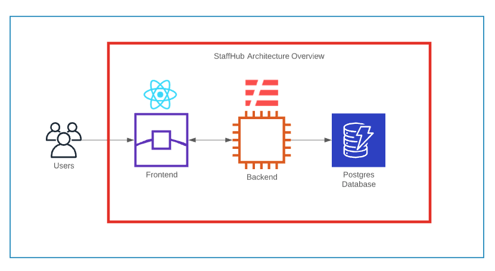

## (Add StaffHub screenshot here)

 A system to manage employee data for your company.

# What is StaffHub
StaffHub is a web application that will help you manage your employee data. An authorized admin with the right credentials is able to login to the system, add a new employee data, edit employee data, delete employee data and finally list and filter employee data.

## Author
- Mamadou Moustapha Bah
    * Author, Software Architect, Infrastructure Architect, Full Stack Developer

## Tech Stack
- Frontend Service Framework: React
- Backend Service Framework: Node + Express
- Database: Postgres

## Architecture Overview
StaffHub is broken down into 2 different services: Frontend and Backend.
- Frontend: Serves the React app that is the web interface for StaffHub
- Backend: Manages data coming into and out of the database.

The interactions between all of these services is described using the following diagram:
    

## Getting started
coming soon...

## Wiki

Visit our wiki for more information about our tech stack, software requirement, database schema, etc...

## Contact
This application is developped by Mamadou Bah. Let's connect on [LinkedIn](https://www.linkedin.com/in/mamadou-bah-9962a711b/).